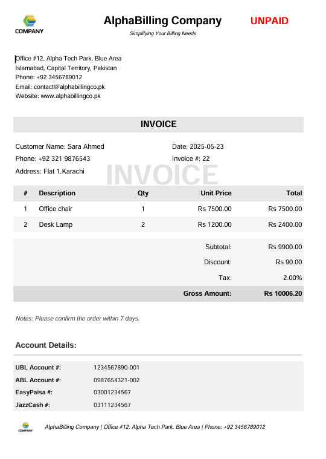

# Python-based-Automated-Invoices-and-Quotations-Generator

This is a Python-based desktop application that allows users to generate professional invoices or quotations in PDF format using either a Graphical User Interface (GUI) or a Command Line Interface (CLI). The system supports customer input, itemized billing, automatic calculations, watermarking (INVOICE/QUOTATION, PAID/UNPAID), and stores all records in a **MySQL database**.


## Features

- **Dual Interface**: Use either GUI (`GUI_app.py` via `tkinter`) or CLI (`CLI_main.py`)
- **Auto-formatted PDF** invoices with watermarking
- **Dynamic Discount and Tax** (Flat or % based)
- **Data Persistence** with MySQL using `mysql-connector-python` and `pymysql`
- **Company Logo and Watermark Support**
- **Invoices folder** to store generated PDFs
- GUI preview image (`GUI.png`)


## Project Structure

```text
├── invoices/                  # Folder for generated PDFs
├── connect_db.py             # Utility to connect with MySQL
├── db_connect.py             # Alternate DB connection script
├── input_collect.py          # Collects input from user (CLI)
├── invoice_generator.py      # Generates and exports the PDF
├── GUI_app.py                # GUI application using tkinter
├── CLI_main.py               # CLI version of the application
├── Dummy_logo.png            # Logo used in PDF
├── GUI.png                   # Screenshot of the GUI
├── invoice_system.sql        # Main DB schema
├── dumb_db/                  # Folder containing exported DB dump
├── requirements.txt          # List of Python dependencies
└── README.md                 # This file
````


## Requirements

Install the following dependencies using pip:

```bash
pip install -r requirements.txt
```

**Dependencies:**

* `fpdf`
* `pymysql`
* `tkinter` (usually pre-installed)


## How to Use

### 1. Setup the MySQL Database

* Start your MySQL server.
* Import the database:

  ```bash
  mysql -u root -p < invoice_system.sql
  ```

Or use the exported dump inside the `dumb_db/` folder.


### 2. Run the Application

#### Option A: GUI

```bash
python GUI_app.py
```

#### Option B: CLI

```bash
python CLI_main.py
```

---

## Input Fields (User Provided)

* Customer Name, Phone, Address, Date
* Invoice/Quotation Number
* Item(s) with Quantity, Description, Unit Price
* Discount (flat or %)
* Tax (%)
* Notes (e.g., *Please pay within 15 days*)
* Watermark: *Invoice/Quotation*, *Paid/Unpaid*


## Output

* PDF file saved to `/invoices` folder
* Stored in MySQL DB

Here is a sample preview of an invoice generated by the system:




## Database Schema

**invoice\_system.sql** creates:

* `invoices` table
* `invoice_items` table (linked by foreign key)
* Stores all generated data including file paths


## Graphic User Interface


## License
This project is licensed under the MIT License.

## Project Status
This project is complete and working as expected. Suggestions and improvements are welcome!


